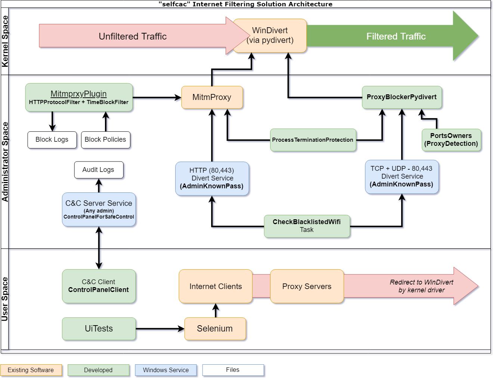

# FilteringComponents

Many small utilities that will help make a parental filtering in windows along with more tools from selfcac repos. Architecture:

### CheckBlacklistedWifi + Tests
**[C#]**
Run this tool to start\stop services based on wifi zones. In short, we check available wifi IDs and with some logic we decide to start or stop a given service. So we can start filtering when the PC is inside a blacklisted zone defined by wifi IDs.

### Common
**[C#]**
Common module between other components. For example, It contains the JSON Serialize\Deserialize utilities.

### ControlPanelClient
**[C#]**
The client to the `ControlPanelForSafeControl` component. It communicates with TCP socket by passing predefined commands and echoing the results. This is a GUI written in Winform.

### ControlPanelForSafeControl
**[C#]**
The server side service to control and act as an admin when needed.
Some of the features:
* Lock access to admin features until given date
* Change password of admin user (to random)
* Start\Stop Firewall 

### HTTPProtocolFilter + Tests + GUI Editor
**[C#]**
This component let us save and load a filtering policy customized to the Internet browsing experience.
Some of the capabilities:
* Allow only domain, domain + sub-domains, mixed
* Check urls for bad words
* Check content of html for bad words
* Support from contain check to Regex
* Quick actions on logs with a GUI Editor.
* Rich output outlining exactly what made each block.

### MitmprxyPlugin
**[Python]**
The filtering plugin we use with the [mitmproxy](https://github.com/mitmproxy/mitmproxy/) to apply the policy we got from `HTTPProtocolFilter`

### ProcessTerminationProtection + PTPConsole
**[C#]**
This library lets you remove the kill permission from any process. We use it to prevent non admin users from stopping our processes with Task Manager (Windows based)

### ProxyBlockerPydivert
**[Python]**
This script uses the pydivert library to block all external proxy connections to avoid ignoring our filter. It uses [PortsOwner](https://github.com/selfcac/PortsOwners) to only affect non admin softwares.

### TimeBlockFilter + Tests + GUI Editor
**[C#]**
Tell the `MitmprxyPlugin` when to block the internet.